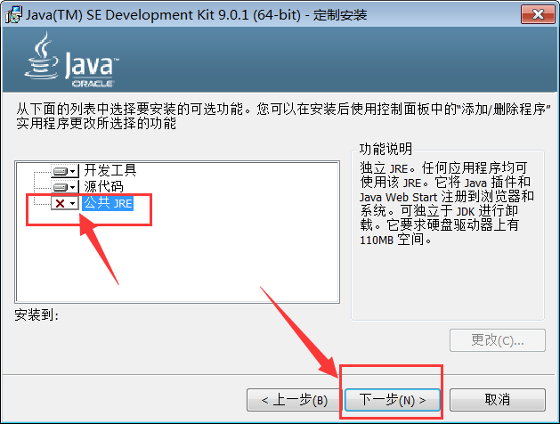

## JDK下载与安装

官方将Java的安装包分为三类: 

- JRE安装包, 官方称其为Java安装包。JRE 是面向一般用户的, 可以运行各种Java程序, 包括服务端和桌面端Java程序。 
- JDK安装包, JDK是给开发人员用的, 其中包含了一套完整的JRE, 再加上必要的开发工具, 例如 创建Java程序, 生成代码签名, 生成文档, 等等功能。此外, JDK还提供了一些监控和调试工具。
- Server JRE 压缩包, 是专为服务端程序量身打造的, 只包含JRE/JDK中最常用的功能。从服务端的角度来看, JRE缺少必要的监控工具, 以及 javac 编译器。而JDK的功能又太多了, 特别是生产环境并不需要的功能, 如浏览器插件, 自动更新, javadoc 工具, JavaFX 等等。此外，去除了不必要的组件, 还可以减少隐藏的安全漏洞。

一般在开发环境, 以及生产、测试环境都是直接安装JDK, 而很少采用JRE。原因在于、JRE就像是一个阉割版，只有基本的Java运行时环境，稍微复杂点的应用就跑不起来。

当然, 从上面的简介可知, 随着 Server JRE 的成熟，以后服务端环境很大可能是只安装 Server JRE。 而像阿里巴巴等重度Java用户, 则维护有自己的JDK分支, 其中深度定制了很多监控相关的特性, 本质上和官方的JDK并无太多区别。

本文首先介绍 Windows 平台下的JDK下载安装步骤。

### Windows下安装JDK

#### 1. 打开Java网站: <https://www.java.com>. 如下图所示:

点击页面下方的 [开发人员](https://www.java.com/zh_CN/download/faq/develop.xml) 链接。 

#### 2. 进入JDK介绍页面。

在JDK介绍页面中, 点击 [JDK 下载](http://www.oracle.com/technetwork/java/javase/downloads/index.html) 链接。 

#### 3. 进入Oracle官网的JDK下载页面。

可以看到,当前(2017年12月11日)的最新版本是 **Java SE 9.0.1**, 找到并点击右边的JDK下载链接。

如果想要下载旧版本的JDK, 如 JDK8 或者 JDK7, 滚动页面到下方, 找到对应的链接即可。操作都是类似的。

#### 4. JDK9下载页面如下所示:

必须选择接受许可协议(Accept License Agreement), 才可以查看下载链接。

下载操作和普通下载类似。鼠标右键点击下载链接, 选择 "目标另存为/链接另存为", 浏览器则会直接下载。 因为文件较大, 如果想要使用外部下载工具, 如迅雷下载, 选择右键菜单 "复制链接地址", 然后在下载工具中新建任务即可。

#### 5. 下载后的文件如下图所示:

在Windows系统中,有时候浏览器下载的文件会被锁定。鼠标右键点击下载后的文件, 选择属性。 在弹出的属性对话框中, 点击 "解除锁定" 按钮, 然后点击确定即可。

如果不解除锁定, 双击打开时会有安全警告, 如下图所示:

点击 "运行" 按钮即可。

#### 6. 双击打开安装程序, 显示安装向导界面。

点击 "下一步" 按钮. 选择安装路径: 

默认的安装路径是 `C:\Program Files\Java\jdk-9.0.1\`, 其中包含了空格, 这里就有个坑。

JDK自身倒是兼容文件路径中的空格, 但某些程序、以及某些启动脚本并不兼容包含空格的路径, 可能会导致一些莫名其妙的错误。

所以选择不带空格的安装路径, 是软件开发人员的一种常识。

选择列表中的第一项 "开发工具",  然后右点击下方的 "更改" 按钮, 弹出更改文件夹对话框。

在下方的文件夹名输入框中填写变化后的目录, 例如 `D:\Develop\Java\jdk-9.0.1\`, 然后点击确定按钮。 开发工具部分的目录选择完成。

选择不安装JRE.

安装完成, 点击 "关闭" 按钮。 

#### 设置PATH环境变量

