## MariaDB下载与安装

### 1. 打开 MariaDB 社区官网: <https://mariadb.org/>, 如下图所示:

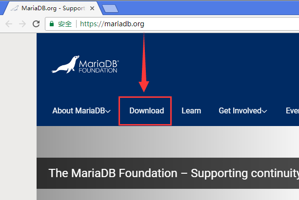

点击其中的 "[Download](https://mariadb.org/download/)" 链接:

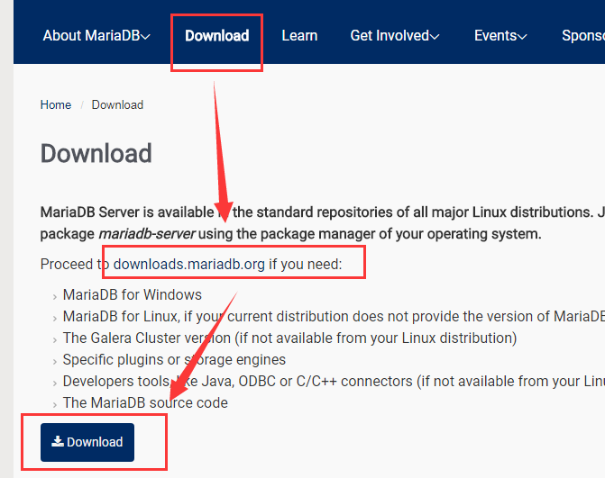

根据提示, 点击下载网站链接 <https://downloads.mariadb.org/>。

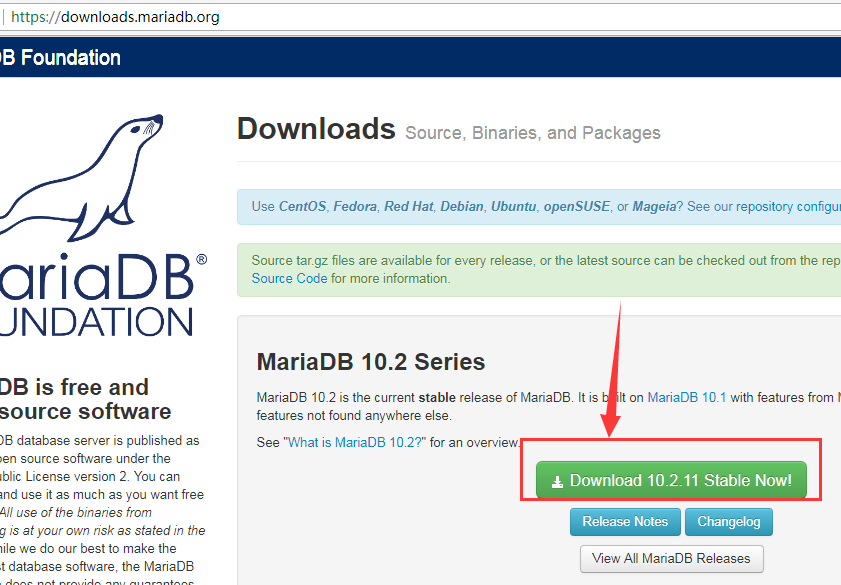

根据页面提示，找到最新稳定版, 点击下载按钮 "[Download 10.2.11 Stable Now!](https://downloads.mariadb.org/mariadb/10.2.11/)", 进入下载页面。

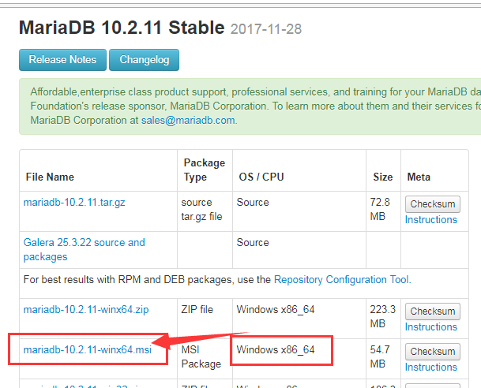

找到 Windows版本, 点击 [mariadb-10.2.11-winx64.msi]() 链接进入下载页面。

打开该页面后会自动弹出下载对话框, 假如没有弹出, 则根据提示, 找到直接下载的链接, 鼠标右键点击，选择另存为即可。

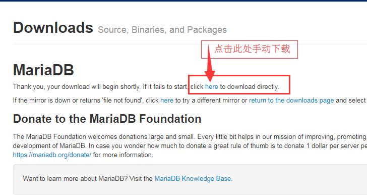

下载后的文件, 如下图所示:

鼠标双击安装包, 执行安装即可。

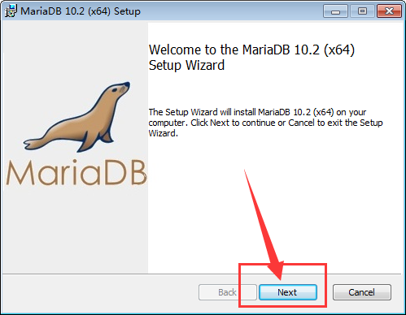

点击 "Next" 按钮进入下一步,

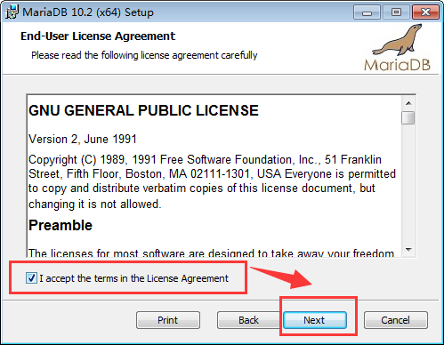

勾选同意用户许可协议, 点击 "Next" 按钮进入下一步,

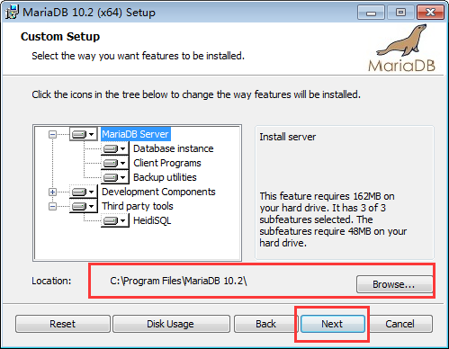

如果需要改变安装路径，可以选择 "Browse..." 按钮进行改变, 然后点击 "Next" 按钮进入下一步,

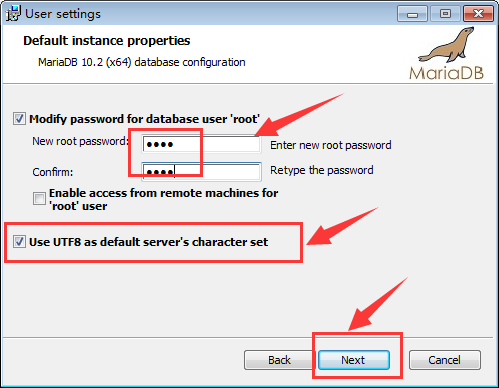

指定 root 的密码, 如 `root`, 勾选使用 UTF8 作为默认编码。

一般来说, root用户只允许从本地访问,这样比较安全。 当然,不管怎么选择, 安装完成之后都可以进行修改。

点击 "Next" 按钮进入下一步;

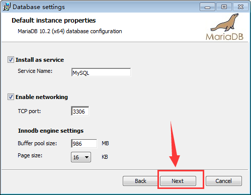

这一步是指定端口号, 以及Windows服务配置; 系统管理的自启动服务,会随着系统一起启动。 如果服务名已存在, 则可以修改。

一般来说,保持默认值, 点击 "Next" 按钮进入下一步;

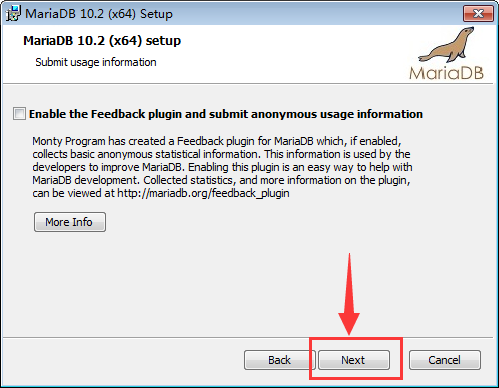

保持默认值, 点击 "Next" 按钮进入下一步;

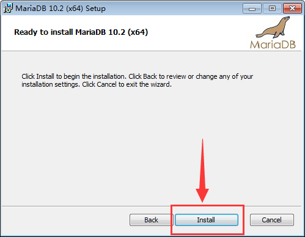

点击 "Install" 按钮, 开始安装;

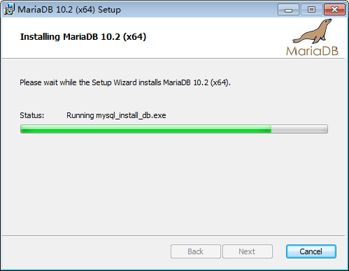

安装过程结束之后, 会显示结束对话框;

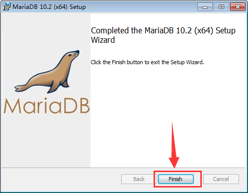

点击 "Finish" 按钮, 安装完毕;

默认会安装一个叫做 HeidiSQL 的图形化客户端工具。 非常好用。

从桌面或者开始菜单, 打开 HeidiSQL:

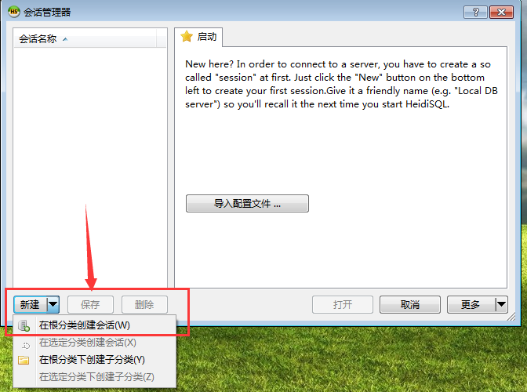

新建一个会话, 默认的名字是 "Unnamed", 可以使用鼠标右键菜单或者F2重命名, 例如`localhost`;

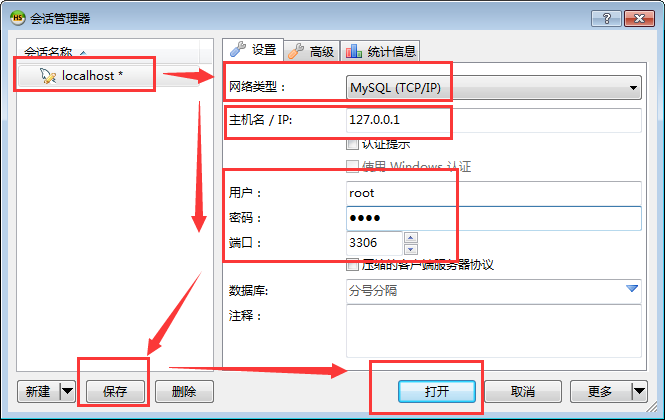

依次填写协议类型, IP地址, 端口号, 用户名密码, 然后保存。

一般来说, 使用 MySQL(TCP/IP) 网络类型。 

如果是生产环境, 也可以选择 SSH 隧道,然后填写跳板机Linux的信息。

接着选择 保存的会话信息, 点击 "打开" 按钮。

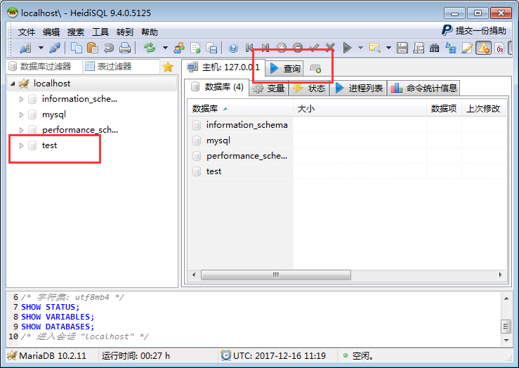

主界面就是这样.

选择数据库, 选择 Table， 就可以查看数据或者执行SQL了。

和其他的客户端基本上一样, 大部分操作都可以通过右键菜单触发。

试着用用吧!

