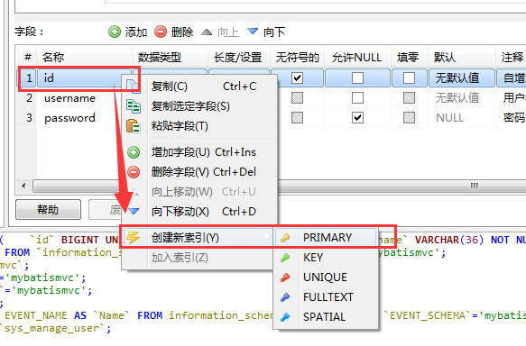

## MariaDB下载与安装


### 1. 打开 MariaDB 社区官网: <https://mariadb.org/>, 如下图所示:


点击其中的 "[Download](https://mariadb.org/download/)" 链接:


根据提示, 点击下载网站链接 <https://downloads.mariadb.org/>。


根据页面提示，找到最新稳定版, 点击下载按钮 "[Download 10.2.11 Stable Now!](https://downloads.mariadb.org/mariadb/10.2.11/)", 进入下载页面。


找到 Windows版本, 点击 [mariadb-10.2.11-winx64.msi]() 链接进入下载页面。


打开该页面后会自动弹出下载对话框, 假如没有弹出, 则根据提示, 找到直接下载的链接, 鼠标右键点击，选择另存为即可。


下载后的文件, 如下图所示:


鼠标双击安装包, 执行安装即可。


点击 "Next" 按钮进入下一步,


勾选同意用户许可协议, 点击 "Next" 按钮进入下一步,


如果需要改变安装路径，可以选择 "Browse..." 按钮进行改变, 然后点击 "Next" 按钮进入下一步,


指定 root 的密码, 如 `root`, 勾选使用 UTF8 作为默认编码。

一般来说, root用户只允许从本地访问,这样比较安全。 当然,不管怎么选择, 安装完成之后都可以进行修改。

点击 "Next" 按钮进入下一步;


这一步是指定端口号, 以及Windows服务配置; 系统管理的自启动服务,会随着系统一起启动。 如果服务名已存在, 则可以修改。

一般来说,保持默认值, 点击 "Next" 按钮进入下一步;


保持默认值, 点击 "Next" 按钮进入下一步;


点击 "Install" 按钮, 开始安装;


安装过程结束之后, 会显示结束对话框;


点击 "Finish" 按钮, 安装完毕;


默认会安装一个叫做 HeidiSQL 的图形化客户端工具。 非常好用。

从桌面或者开始菜单, 打开 HeidiSQL:


新建一个会话, 默认的名字是 "Unnamed", 可以使用鼠标右键菜单或者F2重命名, 例如`localhost`;


依次填写协议类型, IP地址, 端口号, 用户名密码, 然后保存。

一般来说, 使用 MySQL(TCP/IP) 网络类型。 

如果是生产环境, 也可以选择 SSH 隧道,然后填写跳板机Linux的信息。

接着选择 保存的会话信息, 点击 "打开" 按钮。


主界面就是这样.

选择数据库, 选择 Table， 就可以查看数据或者执行SQL了。

和其他的客户端基本上一样, 大部分操作都可以通过右键菜单触发。

试着用用吧!


创建数据库:


鼠标右键点击会话名称, 选择菜单项 "创建新的 --> 数据库".

弹出新建数据库对话框:


填写数据库名称, 例如 `mybatismvc`, 选择字符集, 如 `utf8_general_ci`, 完成之后点击确定。

在MySQL中, 字符集伴随着排序规则(COLLATE), `utf8_general_ci` 的意思是: "UTF8" 编码, 常规字符集(general), 排序和比较时不区分大小写(ci, case insensitive)。

对应的数据库定义SQL如下所示:

```
CREATE DATABASE `mybatismvc`  COLLATE 'utf8_general_ci';
```

> 说明, DDL（Data Definition Language）,数据库定义语言, 常用的关键字如 , 
> 常用的包括 建库,建表,建索引等等,关键字包括 创建(`CREATE`), 删表/库(`DROP`), 改表(`ALTER`), 查看(`SHOW`)等等, 详情请参考: <https://mariadb.com/kb/en/library/data-definition/>。
> 另外, DML 用于对表中的数据进行增删改查。包括, 插入(`INSERT`), 更新(`UPDATE`), 删除(`DELETE`), 查询(`SELECT`) 等。
> 可以看到, DDL 和 DML 的关键字是两套, 区分度很强。

创建完成之后, HeidiSQL客户端会自动刷新界面。


可以在左侧列表中看到我们新创建的数据库。

根据上图提示, 打开一个新的查询标签, 在其中可以输入SQL, 然后点击执行按钮(蓝色的三角形箭头)即可。

显示所有可见数据库的SQL如下:

```
show databases;
```

创建表:


鼠标选择数据库, 如 `mybatismvc`, 点鼠标右键, 选择菜单项 "创建新的 --> 表".

HeidiSQL界面下方展示的SQL日志为:

```
USE mybatismvc;
```


输入表名, 注释; 

点击 "+添加" 按钮可以增加字段, 填写字段名称, 数据类型, 长度, 非空,以及注释信息。

完成之后点击 "保存" 按钮。

日志信息中可以看到, 对应的建表语句如下:

```
CREATE TABLE `sys_manage_user` (
    `id` BIGINT UNSIGNED NOT NULL COMMENT '自增ID',
    `username` VARCHAR(36) NOT NULL COMMENT '用户名',
    `password` VARCHAR(36) NULL COMMENT '密码'
)
COMMENT='管理员用户表'
COLLATE='utf8_general_ci'
ENGINE=InnoDB
;
```

添加主键:



鼠标右键单击 id 字段, 选择 "创建新索引 -- > PRIMARY",  然后点击 "保存" 按钮。

对应的 SQL 如下所示:

```
ALTER TABLE `sys_manage_user`
	ADD PRIMARY KEY (`id`);
```

设置主键自增长:

> **MySQL限制**: AUTO_INCREMENT 只能在 主键或者唯一索引列中设置。


选择 id 这一字段,  点击 "默认" 部分, 在弹出界面中选择 "AUTO_INCREMENT", 然后点击 "确定" 按钮, 完成后保存。

对应的SQL如下:

```
ALTER TABLE `sys_manage_user`
	CHANGE COLUMN `id` `id` BIGINT(20) UNSIGNED NOT NULL AUTO_INCREMENT COMMENT '自增ID' FIRST;
```

当然, 添加主键 和设置自增长这两个步骤,可以和建表一起完成。 此处为了演示而拆分为3个步骤。

完整的SQL可以在 "CREATE代码" 中查看:


完整的SQL代码如下所示:

```
CREATE TABLE `sys_manage_user` (
	`id` BIGINT(20) UNSIGNED NOT NULL AUTO_INCREMENT COMMENT '自增ID',
	`username` VARCHAR(36) NOT NULL COMMENT '用户名',
	`password` VARCHAR(36) NULL DEFAULT NULL COMMENT '密码',
	PRIMARY KEY (`id`)
)
COMMENT='管理员用户表'
COLLATE='utf8_general_ci'
ENGINE=InnoDB
;
```


