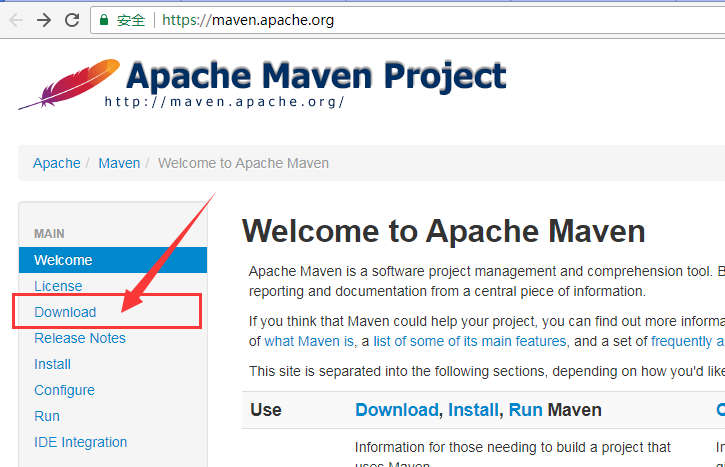
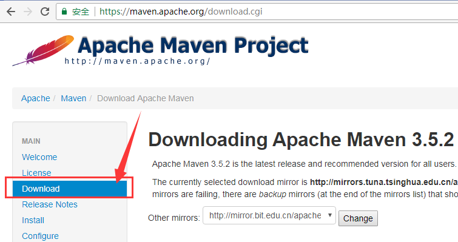
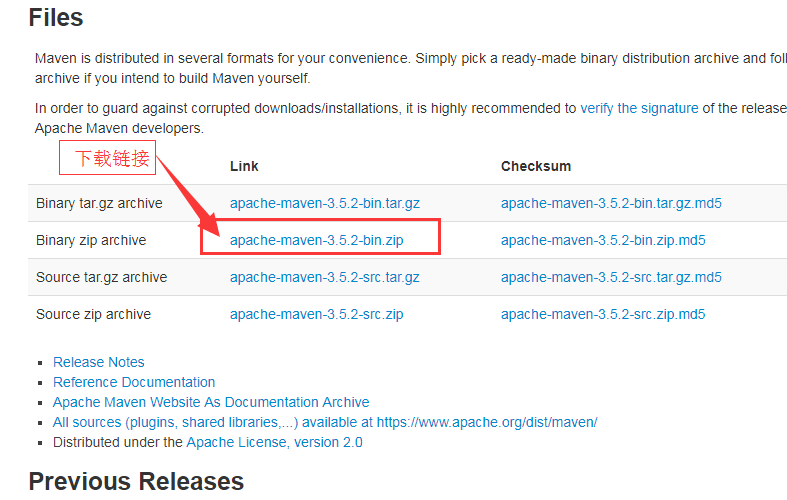
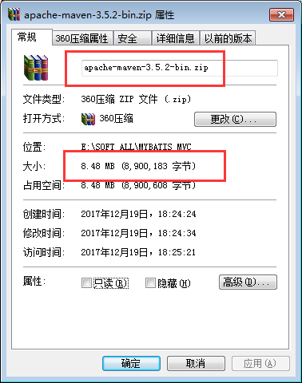
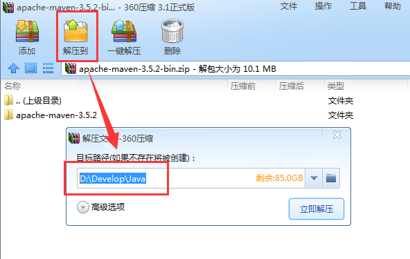
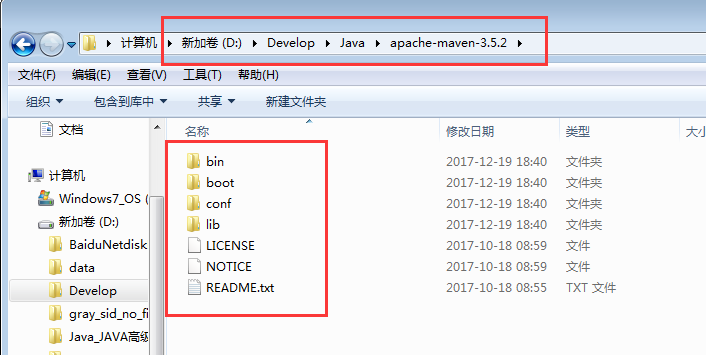

# MAVEN 下载与安装

Maven是Java项目构建事实上的标准, 稍微正规点的Java项目, 基本上都在使用Maven工具。


## 下载Maven

搜索 "Maven" 关键字, 可以查到官网: <https://maven.apache.org/>

打开之后界面如下所示:



找到并点击 [Download 菜单](https://maven.apache.org/download.cgi),



下拉页面, 找到下载链接。




Windows 一般使用 zip 包, Linux 一般使用 tar.gz 压缩包.

通过链接下载对应的文件, 如 [apache-maven-3.5.2-bin.zip](http://mirrors.tuna.tsinghua.edu.cn/apache/maven/maven-3/3.5.2/binaries/apache-maven-3.5.2-bin.zip).

请注意区分, 我们需要下载的是 bin 而不是 src。

如果是Linux, 使用 `wget` 获取 tar.gz 文件即可, 如:

```
wget http://mirrors.tuna.tsinghua.edu.cn/apache/maven/maven-3/3.5.2/binaries/apache-maven-3.5.2-bin.tar.gz -O apache-maven-3.5.2-bin.tar.gz
```

其中, `-O` 参数指定输出文件名, 用于应付不规则的复杂URL。


下载完成之后, 可以看到是大约8MB左右的文件。



各平台或者版本可能稍微不一致。


解压文件, 注意 maven 压缩包内就有一级目录.



例如解压到 `D:\Develop\Java`, 解压后的目录如下所示:



可以看到, 和大部分工具一样, 里面有一个 bin 目录。

我们将 bin 目录加入 `PATH` 环境变量, 则可以在任意路径调用 `mvn` 命令。

```
D:\Develop\Java\apache-maven-3.5.2\bin
```

同样, 增加一个环境变量 `MAVEN_HOME`, 值为 

```
D:\Develop\Java\apache-maven-3.5.2
```

如果安装目录不同, 请根据具体情况设置。

然后进行验证:

```
mvn --version
```

显示的结果可能如下所示:

```
C:\Users\Administrator>mvn --version
Apache Maven 3.5.2 (......)
Maven home: D:\Develop\Java\apache-maven-3.5.2\bin\..
Java version: 1.8.0_65, vendor: Oracle Corporation
Java home: D:\Develop\Java\jdk1.8.0_65\jre
Default locale: zh_CN, platform encoding: GBK
OS name: "windows 7", version: "6.1", 
	arch: "amd64", family: "windows"
```

至此, 基本的Maven安装完成。

