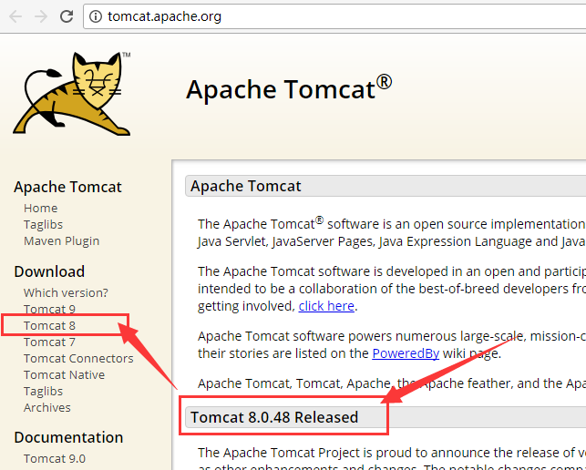
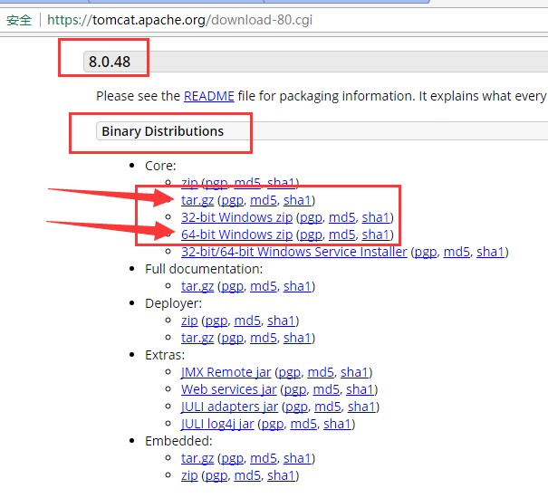
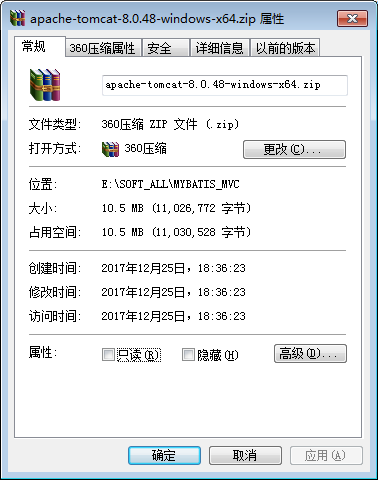
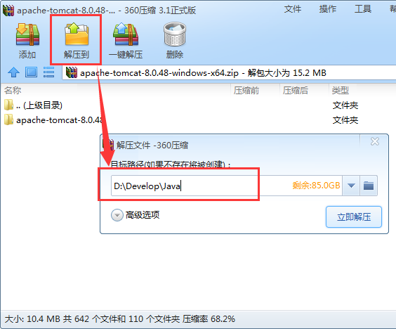
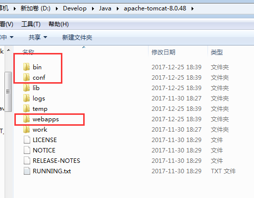
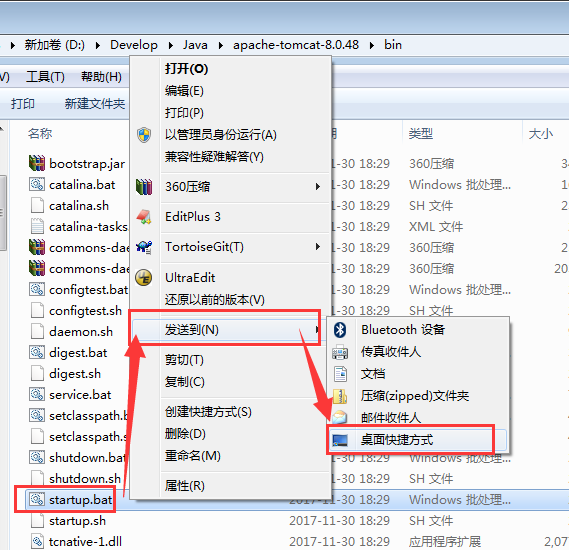
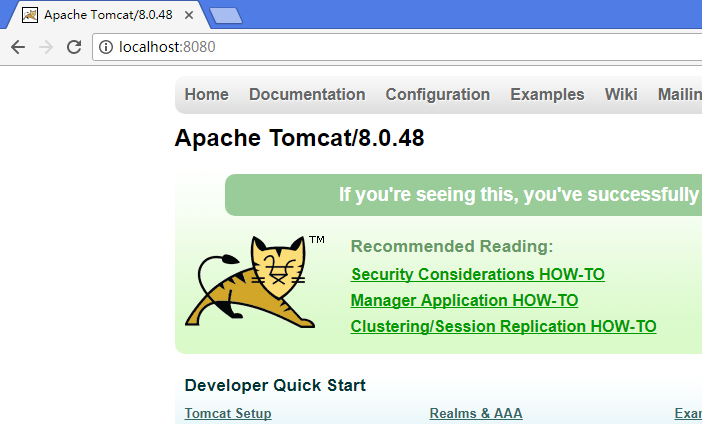

# Tomcat 下载与安装


## 下载 Tomcat

搜索 "Tomcat" 关键字, 可以查到官网: <http://tomcat.apache.org/>

打开之后界面如下所示:



可以看到, 当前最新稳定版是 "Tomcat 8.0.48 Released", 找到左侧 Download 菜单下面的 "Tomcat 8" 链接, 点击进入Tomcat 8 下载页面: <https://tomcat.apache.org/download-80.cgi>



下拉页面, 找到下载链接。

Windows 一般使用 zip 包, Linux 一般使用 tar.gz 压缩包.

通过链接下载对应的文件, 如 [64-bit Windows zip](http://mirrors.tuna.tsinghua.edu.cn/apache/tomcat/tomcat-8/v8.0.48/bin/apache-tomcat-8.0.48-windows-x64.zip).

请注意区分, 我们需要下载的是 bin 而不是 src。

下载完成之后, 可以看到是大约 10.5MB 左右的文件。



各平台或者版本可能稍微不一致。


解压文件, 注意 tomcat 压缩包内就有一级目录.



例如解压到 `D:\Develop\Java`, 解压后的目录如下所示:



解压后的目录就是 `D:\Develop\Java\apache-tomcat-8.0.48`。

可以看到, 和大部分工具一样, 里面有一个 bin 目录。

如果我们将 bin 目录下面的 `startup.bat` 发送到桌面快捷方式, , 则可以在桌面直接打开Tomcat。



如果是Windows服务器环境,则可以使用 `tomcat8w.exe` 程序。

一般来说, 开发环境我们使用 bat 脚本, 可以减少很多麻烦。


双击桌面上的快捷方式, 打开Tomcat, 日志可能如下所示:

```
...
...
25-Dec-2017 18:54:00.685 信息 [main] 
	org.apache.coyote.AbstractProtocol.start 
	Starting ProtocolHandler ["http-apr-8080"]
25-Dec-2017 18:54:00.701 信息 [main] 
	org.apache.coyote.AbstractProtocol.start 
	Starting ProtocolHandler ["ajp-apr-8009"]
25-Dec-2017 18:54:00.707 信息 [main] 
	org.apache.catalina.startup.Catalina.startServer 
	startup in 1104 ms
```

从中可以看到, Tomcat 使用了 8080 端口,  

如果正常启动, 浏览器打开 <http://localhost:8080/> 地址:



至此, 基本的Tomcat安装完成。

如果启动报错或者一闪而过, 则可以通过 `conf/server.xml`文件修改端口号, 或者通过 CMD 窗口启动,以查看错误日志。

