# Idea下载与安装

IDEA编辑器, 全名 IntelliJ IDEA, 是 JetBrains 开发的 Java 集成开发环境。 近年来市场超越 Eclipse, 已成为最流行的的开发工具。

社区版是免费的,但功能被限制了; 商业版对于学生认证,教育培训,开源组织免费。详情请通过搜索引擎来查找。

## 下载 Idea

搜索 "Idea" 关键字, 可以查到官网: <https://www.jetbrains.com/idea/>

打开之后界面如下所示:

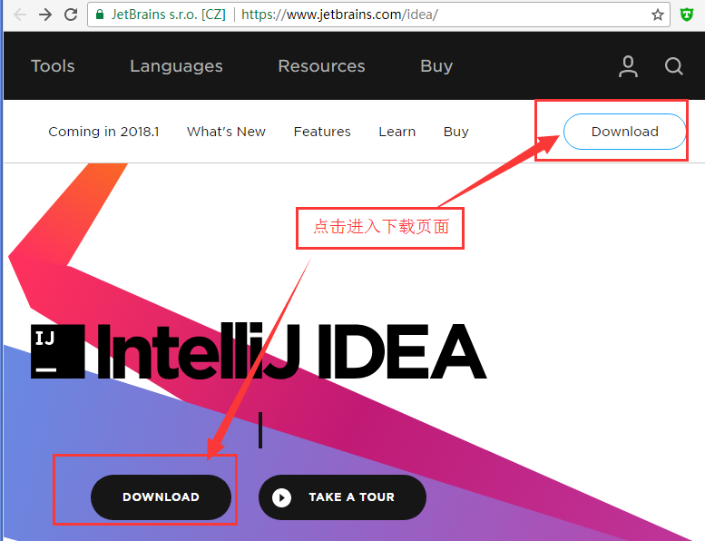

找到页面中的 Download 按钮, 点击进入Idea下载页面: <https://www.jetbrains.com/idea/download/>

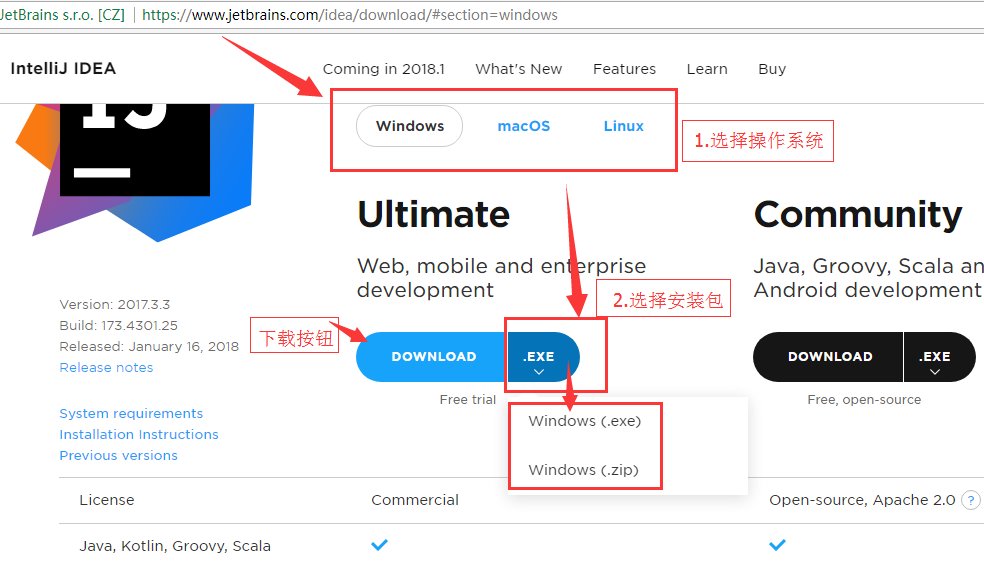

下拉页面, 找到下载链接。

Windows一般选择`.exe`安装包, MacOS是dmg安装包, Linux一般使用`tar.gz`压缩包.

Idea内置集成了JDK, 所以简单开发可以不单独安装JDK。

通过链接下载对应的文件, (如果下面的链接不能下载,请打开官网下载):

- [Windows安装包: ideaIU-2017.3.3.exe](https://download.jetbrains.com/idea/ideaIU-2017.3.3.exe)
- [Windows绿色版: ideaIU-2017.3.3.win.zip](https://download.jetbrains.com/idea/ideaIU-2017.3.3.win.zip)
- [MacOS安装包: ideaIU-2017.3.3.dmg](https://download.jetbrains.com/idea/ideaIU-2017.3.3.dmg)
- [Linux安装包: ideaIU-2017.3.3.tar.gz](https://download.jetbrains.com/idea/ideaIU-2017.3.3.tar.gz)

请根据需要下载具体的版本。

如果是Linux, 使用 `wget` 获取 tar.gz 文件即可, 如:

```
wget https://download.jetbrains.com/idea/ideaIU-2017.3.3.tar.gz -O ideaIU-2017.3.3.tar.gz
```

其中, 可选参数 `-O` 指定输出文件名, 用于应付不规则的复杂URL。

下载完成之后, 可以看到是 500MB 以上的文件。

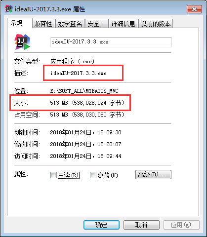

各平台或者版本可能稍微不一致。


## 安装 Idea

鼠标双击安装文件, 开始安装过程.


例如安装目录选择 `D:\Develop`, 安装后在桌面会创建快捷方式:
。


安装完成后, 双击快捷方式, 打开 Idea, 显示欢迎界面:


如果直接进入项目, 则可以选择菜单 "File --> Close Project" 关闭项目回到欢迎界面。

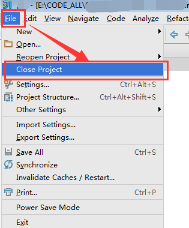


## 创建项目


在欢迎界面, 点击 "Create New Project"  创建新项目。


或者选择菜单 "File --> New --> Project" 即可。
 
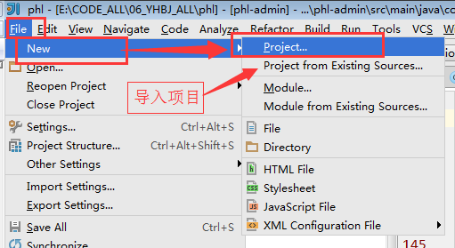

然后看到新建项目的对话窗口:

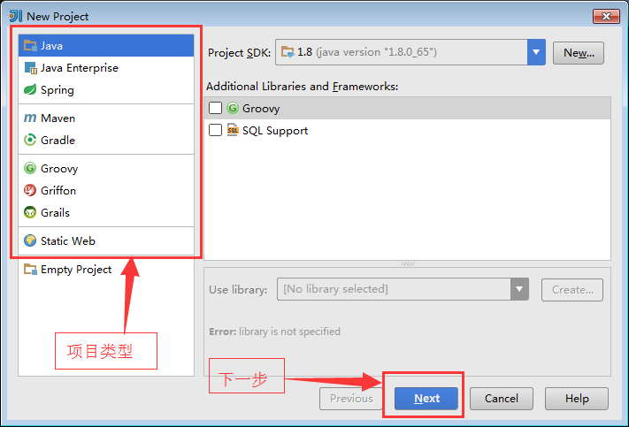


在其中选择项目类型, 各种项目的配置可能略有不同。


例如选择 "Java" 项目, 然后点击 "Next" 按钮进入下一步。

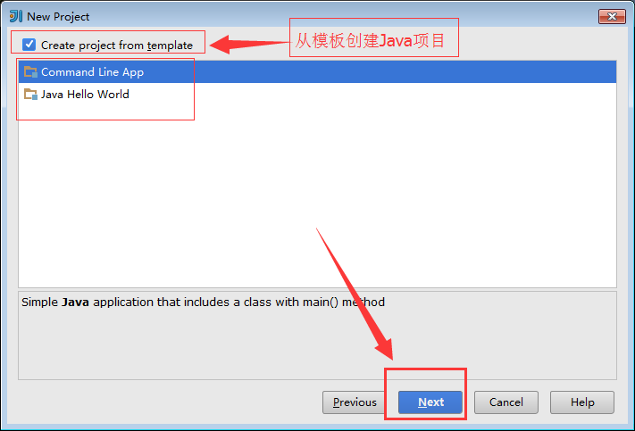

在其中, 可以选择模板,也可以不选择, 简单项目都差不多。

点击 "Next" 按钮进入下一步。

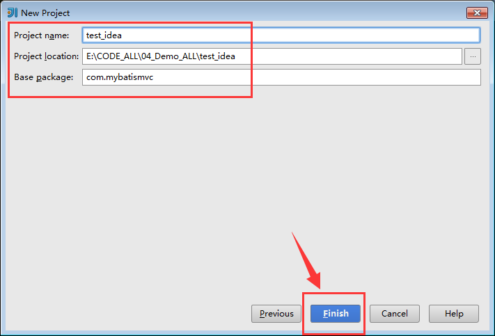

填写项目相关的信息。例如, 项目名称: "test_idea", 目录位置: `E:\CODE_ALL\04_Demo_ALL\test_idea`, 基础包名: `com.mybatismvc`。

然后点击  "Finish" 按钮完成项目创建。

进入Idea的项目界面。

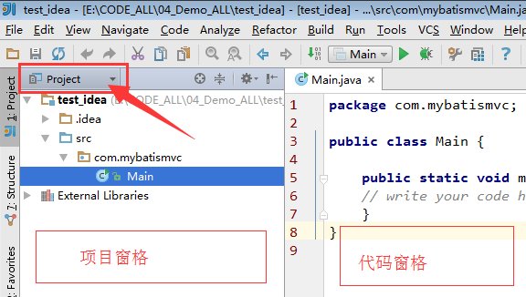

其中左侧的叫做项目窗格(Project), 右边叫做代码区。

### 打开文件夹

需要打开文件夹怎么办? 在项目窗格中, 选择某个文件, 点击鼠标右键, 在弹出的菜单中选择 "Show in Explorer" 即可。 文件夹也就是文件查看器(Explorer)。

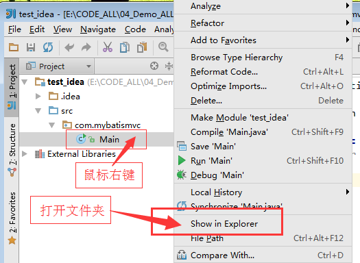


### 运行代码

在 main 方法中加上一些测试代码。

如下所示:

```
package com.mybatismvc;

public class Main {

    public static void main(String[] args) {
        System.out.println("简单的Hello-World宣布出世!");
    }
}
```

然后, 鼠标右键单击代码区, 弹出的右键菜单如下所示:

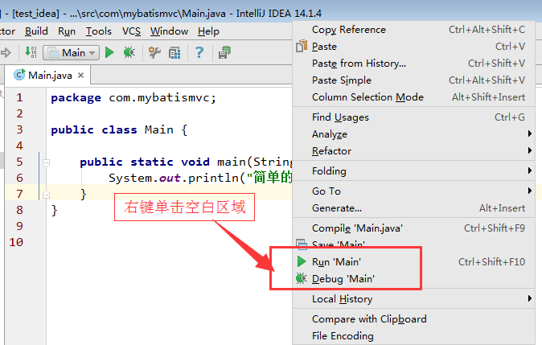


因为具有标准的 main 方法, 所以右键菜单中出现了 "Run" 和 "Debug" 菜单项。

Run就是直接执行, 选择 Debug 则是调试运行。 在调试之前,可以加入断点和条件断点。

选择菜单项"Run Main"执行, 结果如下所示:

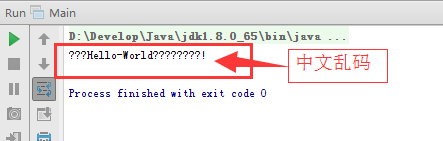

咦! 怎么出现了乱码!!! 怎么办呢?

这就涉及到 `.java` 源文件的编码问题。

### 设置项目编码

出乱码问题很闹心, 需要约定好。 

业界普遍的做法是: Java项目的所有编码全部采用 "UTF-8"。

下面来设置各种文件的编码。

选择菜单 "File --> Settings...", 如下所示

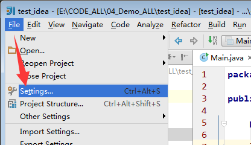

在设置对话框(Settings)中, 搜索 "enc", 或者 "encoding", 接口快速定位到设置文件编码的 "Editor --> File Encodings" 项。

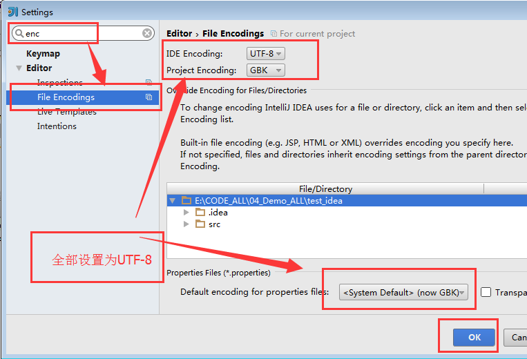

可以发现, Windows系统默认的编码是 GBK, 这就是造成乱码的原因。

将所有可配置的编码都设置为 "UTF-8"。 然后点击 "OK" 按钮。

接着将 Main.java 文件的编码也设置为 "UTF-8", 如下图所示:

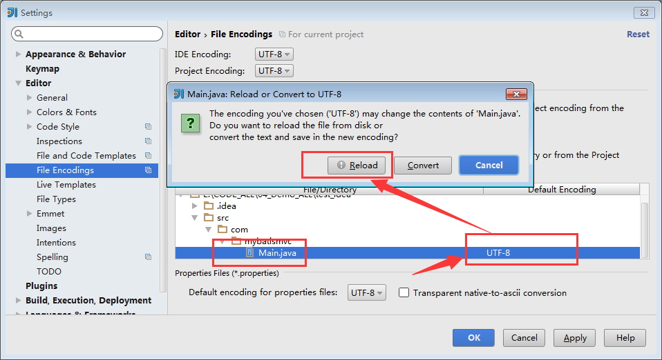

问题更严重了, 源码文件的显示也乱码。 

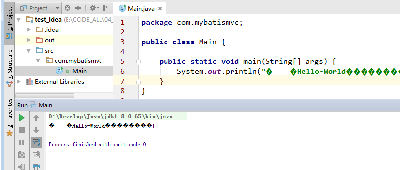

我们只能编写中文信息, 重新编辑中文部分:

```
System.out.println("简单的Hello-World宣布出世!");
```

重新运行, 控制台打印的信息显示正常, 如下所示:

```
简单的Hello-World宣布出世!

Process finished with exit code 0
```

已存在的.java源文件的转码, 可以使用其他文本编辑器打开, 使用 "另存为/选择编码" 的方式来处理。


至此, 基本的Idea安装完成。

如果出现解决不了的错误, 最好咨询您身边的同学, 或者通过QQ群提问等方式解决。

