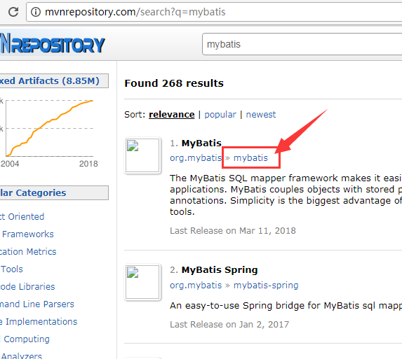
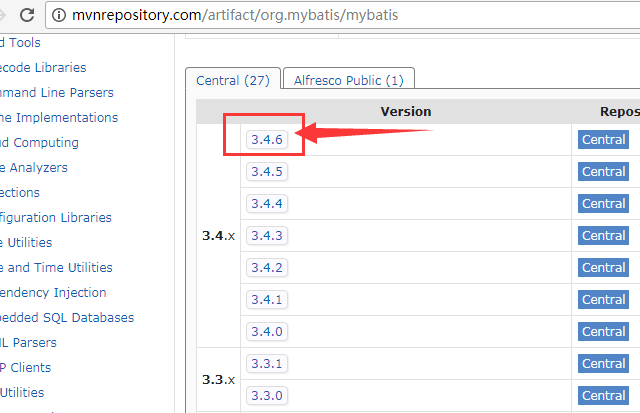
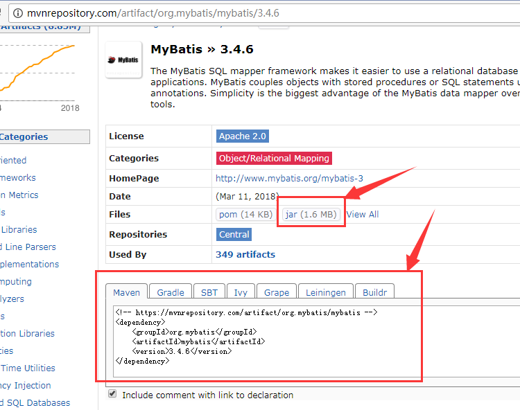

# 10.2 环境配置

MyBatis依赖与类库

打开网站 <http://mvnrepository.com/>, 搜索关键字 `mybatis`, 可以看到相关的依赖库列表。如下图所示:



选择第一个搜索结果。 进入版本列表页面：



一般来说, 选择最新的版本, 进入详情页面:



在该页面中, 可以复制 MAVEN 依赖的XML配置, 也可以直接下载相应的jar文件。

其中MAVEN依赖信息如下所示:

```
<dependency>
    <groupId>org.mybatis</groupId>
    <artifactId>mybatis</artifactId>
    <version>3.4.6</version>
</dependency>

```


